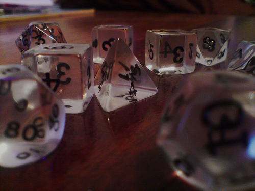

# PolyhedralTodoList

You can manage Google Tasks as merged TODO tasks on Android.

### Details
Merged TODO Tasks
* Add a new task
* Move up/down a task

TODO Tasks
* Add a new task
* Move up/down a task
* Edit titles

TODO List
* Add a new list
* Edit titles

## Credit
photo credit: <a href="http://www.flickr.com/photos/12840961@N03/2726434063">Transparent Roleplaying Dice 02</a> via <a href="http://photopin.com">photopin</a> <a href="https://creativecommons.org/licenses/by/2.0/">(license)</a>
